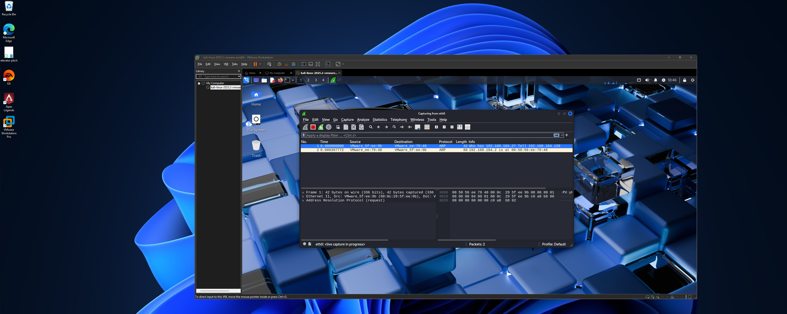

# 🖥️ Kali Linux Wireshark Lab in VMware Workstation Pro

## Overview
This project documents my hands-on experience setting up a cybersecurity lab environment using VMware Workstation Pro, installing Kali Linux, and leveraging Wireshark for packet analysis. It demonstrates core skills in virtualization, Linux administration, and network forensics.

---

## Steps & Skills Demonstrated

### 1. **Virtual Machine Setup**
- Used **VMware Workstation Pro** to create an isolated virtual environment.
- Allocated system resources (CPU, RAM, disk) and configured network settings for optimal performance.

**Screenshot:**  
[VM Setup] [Screenshot 2025-07-24 104331.png](https://github.com/Andrew-ops-cyber/kalilinux-wireshark-vm/blob/main/Screenshot%202025-07-24%20104331.png?raw=true)

---

### 2. **Kali Linux Installation**
- Downloaded the official **Kali Linux ISO**.
- Installed Kali Linux as the guest OS in the VM.
- Performed basic system configuration and updates for security and usability.

**Screenshot:**  


---

### 3. **Wireshark Installation & Fundamentals**
- Installed Wireshark on Kali Linux using the terminal:
  ```bash
  sudo apt update
  sudo apt install wireshark
  ```
- Configured Wireshark to capture live network traffic within the VM.

**Screenshot:**  


---

### 4. **Packet Capture & Analysis**
- Captured live network packets from various interfaces.
- Utilized Wireshark’s filtering capabilities to:
  - Identify specific protocols (e.g., TCP, UDP, ICMP).
  - Locate source and destination IP addresses.
  - Examine packet details and payloads.

**Screenshot:**  


---

### 5. **Filtering & Managing Data**
- Applied display filters to isolate traffic types and sources, such as:
  - `ip.addr == x.x.x.x` for specific IP addresses
  - `tcp.port == 443` for HTTPS traffic
  - `http` for web traffic
- Learned to export packet captures for further analysis and reporting.

**Screenshot:**  


---

## Key Learnings

- **Virtualization:** Efficiently setting up and managing virtual machines for cybersecurity labs.
- **Linux Administration:** Installing, configuring, and maintaining a Linux OS.
- **Network Forensics:** Using Wireshark for real-time packet capture and deep packet inspection.
- **Filtering Techniques:** Employing Wireshark filters to streamline analysis and highlight relevant data.

---

## Why This Matters

Setting up a controlled lab environment is foundational for cybersecurity analysts. This project has helped me develop practical incident response and network analysis skills, preparing me for real-world threat detection and investigation scenarios.

---

## Get Started

1. Download [VMware Workstation Pro](https://www.vmware.com/products/workstation-pro.html).
2. Get the [Kali Linux ISO](https://www.kali.org/get-kali/).
3. [Wireshark Documentation](https://www.wireshark.org/docs/)

---

**Project by Andrew Ramirez**
